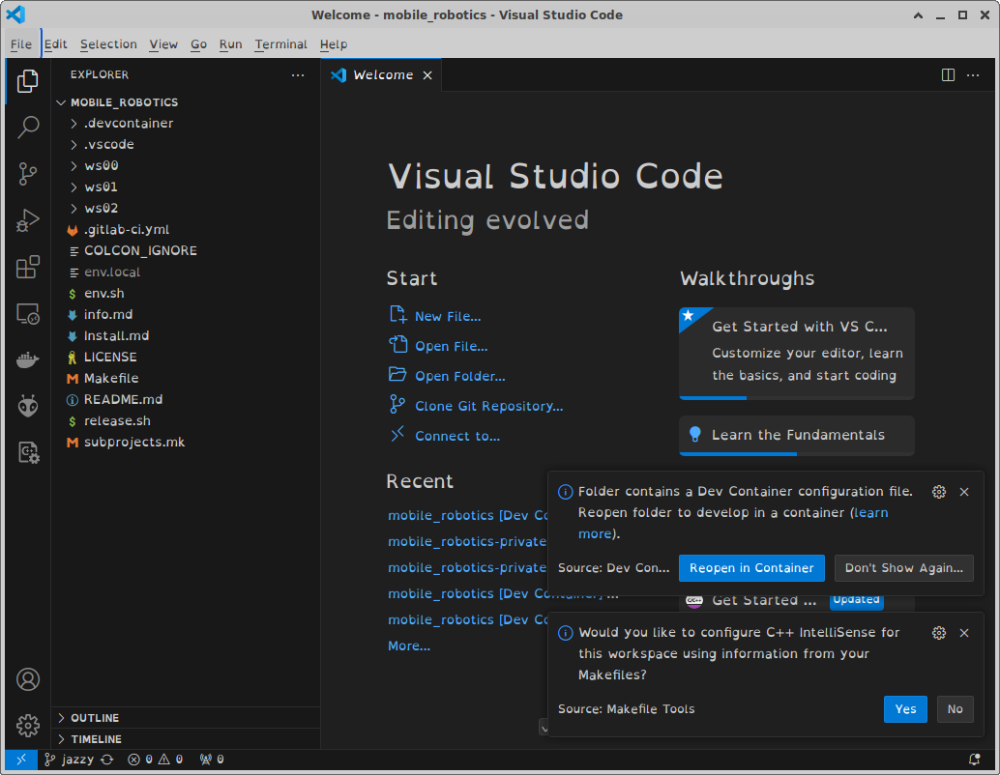
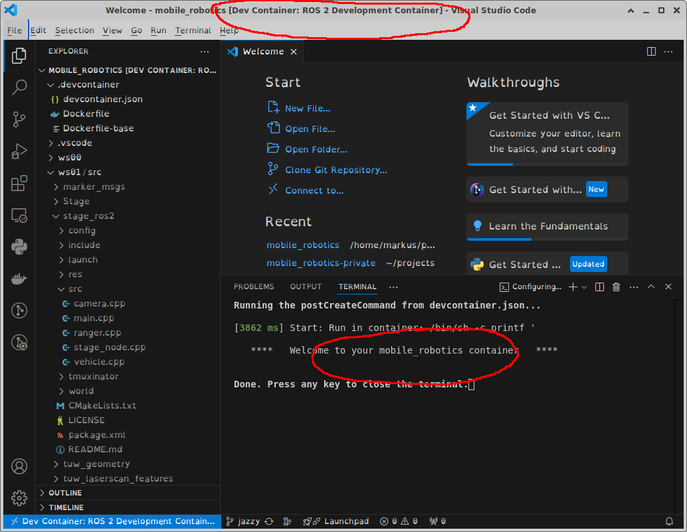
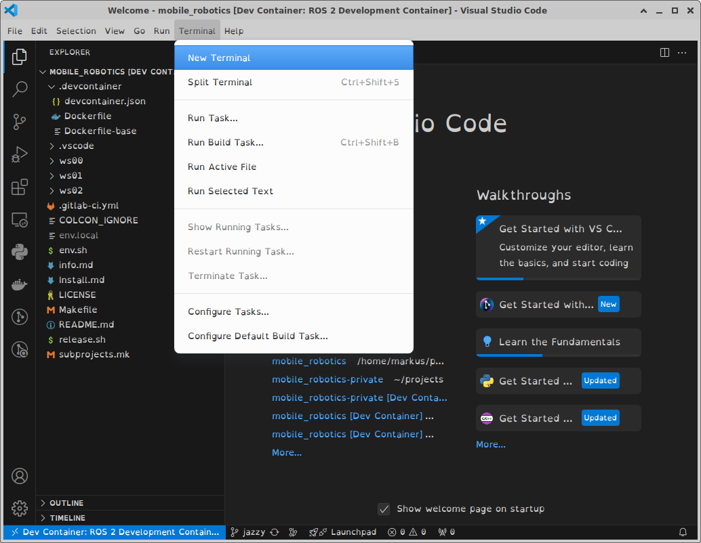
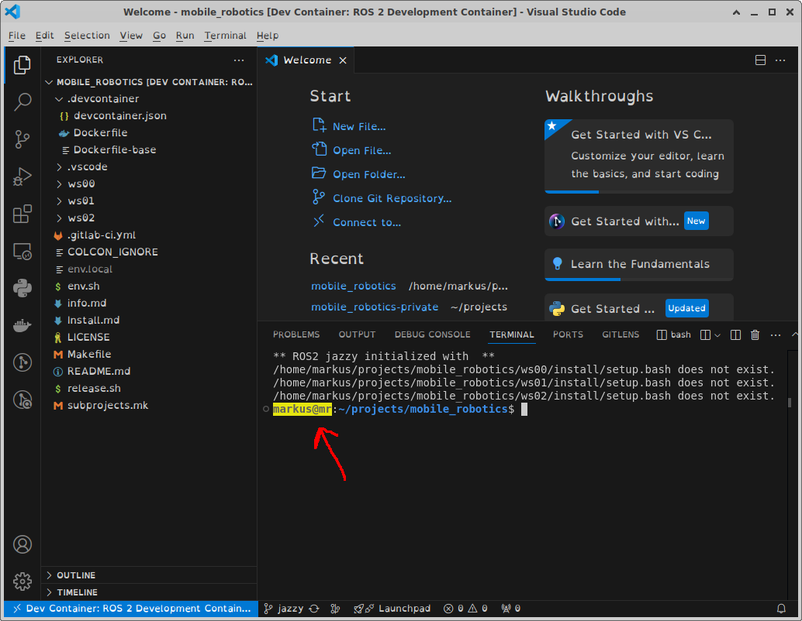
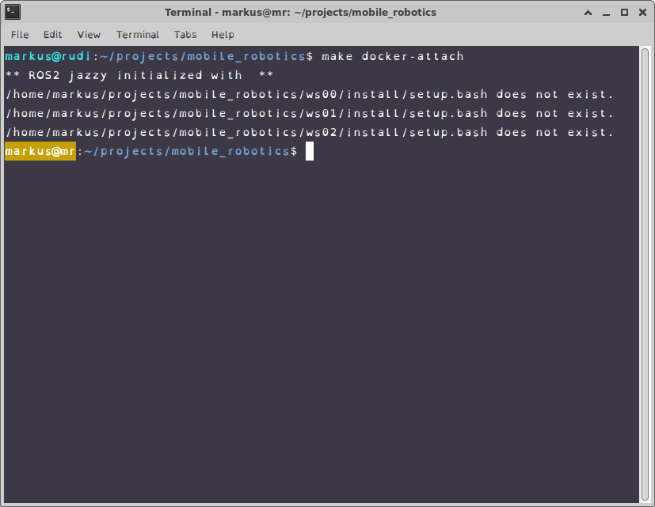
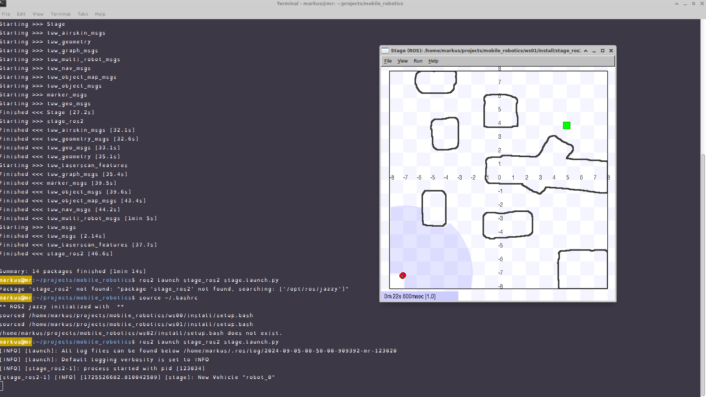
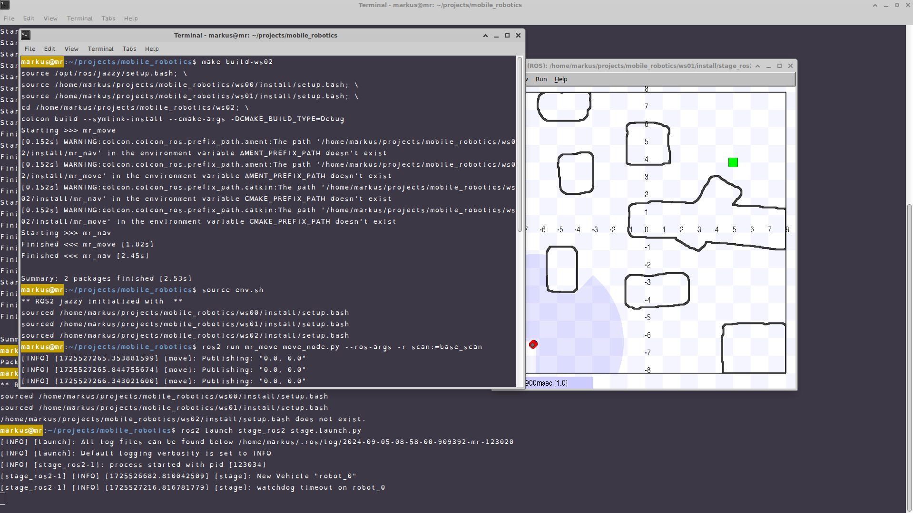

# Project root for the [LVA 183.660 Mobile Robotics WS2024](https://tiss.tuwien.ac.at/course/courseDetails.xhtml?courseNr=183660&semester=2024W)

You can place this projecte in your home folder under `$HOME/projects/mobile_robotics`. 

# Setup and Install {-}

This document contains installation and setup instructions to detail the setup of the lecture environment. 

The simulated robot is controlled by *ROS* (Robot Operating System, running on Linux) which runs inside a docker container in order to do the exercises. We tested the environment with the ROS version named "*jazzy*" on *Ubuntu 24.04* inside a docker container on *Ubuntu 22.04,  24.04*. Other operating systems and version can be used at your own risk, without any support.

**Please prepare your system using one of the following options (A or B)**

---

# Option A - Ubuntu with docker

## Docker
1. First install docker on your system <br> Details can be found under [Install using the apt repository](https://docs.docker.com/engine/install/ubuntu/#install-using-the-repository)
2. Setup your user to manage Docker <br> Details can be found under [Manage Docker as a non-root user](https://docs.docker.com/engine/install/linux-postinstall/#manage-docker-as-a-non-root-user) 

## Directories
We distinguish between
* Projects directory - place with all projects you are working on (`~/projects`)
* Project root - a single project (`~/projects/mobile_robotics`)
* Workspace directory - defined by the ROS-Ecosystem to host nodes with sources and binaries. A single project can host multiply workspaces. (`~/projects/mobile_robotics/ws00`, `~/projects/mobile_robotics/ws01`, `~/projects/mobile_robotics/ws02`)

### Projects directory:
Create a projects directory somewhere in your home directory on the docker host, e.g. in `~/projects`. It will be used to host your projects.

#### .bashrc
Prepare your _.bashrc_ so that your work space get sourced if you open a terminal in work space with an _env.sh_ file. All other ROS project sourcing commands in your _.bashrc_ should be removed! 
```
echo 'export PROJECTS_DIR=${HOME}/projects' >> ~/.bashrc           # defines your projects base
echo "if [ -f "env.sh" ]; then source env.sh; fi" >> ~/.bashrc     # forces your bash to source env.sh if it exists
source ~/.bashrc                                                   # reloads/sources your bash
mkdir ${PROJECTS_DIR}                                              # creates the PROJECTS_DIR folder
```
### Project root
The project root will host our project. The directory structure is available as a git repository ready for you to clone.

#### Clone mr2024_root

Configure and add your SSH key to our gitlab server at [gitlab.tuwien.ac.at](gitlab.tuwien.ac.at). A tutorial is available at [https://docs.gitlab.com/ee/user/ssh.html](https://docs.gitlab.com/ee/user/ssh.html)
We are also suggesting creating a GitHub account and to upload ssh keys as well [https://github.com/settings/keys].

If the .bashrc is ready, we can source it and clone the project root into a directory named "mobile_robotics".
``` bash
source ~/.bashrc
cd ${PROJECTS_DIR} 
git clone ssh://git@gitlab.tuwien.ac.at:822/lva-mr/2024/project.git mobile_robotics
# git clone https://gitlab.tuwien.ac.at/lva-mr/2024/project.git mobile_robotics
```
#### .env.local
To host multiple mobile robotics projects, we introduced a `.env.local` file. It configures your project and is used by `env.sh`
It will be created when env.sh is sourced for the first time and it should not be commited into any repository.
``` bash
cd ${PROJECTS_DIR}/mobile_robotics
source ~/.bashrc
```

On a system with a native ROS installation or inside your docker container, you will see
``` 
** ROS2 jazzy initialized with  **
/home/your_user/projects/mobile_robotics/ws00/install/setup.bash does not exist.
/home/your_user/projects/mobile_robotics/ws01/install/setup.bash does not # exist.
/home/your_user/projects/mobile_robotics/ws02/install/setup.bash does not exist.
```

On a docker host without ROS, you will instead see
``` 
A 'env.local' will be created with the project name 'mobile_robotics-private'
ROS_DISTRO 'jazzy' not installed!
```

### Workspace directories:

We are using two workspaces, `ws01` and `ws02`. `ws01` holds existing stuff like our simulation environment. `ws02` holds your things. There is also a `ws00` but this one is only for people interested in details to ROS2 navigation.

#### Clone 
If the .bashrc and the project root is ready we can source it and use the probided Makefile to clone the repos containing the packages we want to use into the correct workspaces.

``` bash
cd $MR_DIR
make clone
```
### VSCode:
Install vscode with the Remote Development Extension on your docker host machine. More details can be found under [Setup ROS 2 with VSCode and Docker](https://docs.ros.org/en/jazzy/How-To-Guides/Setup-ROS-2-with-VSCode-and-Docker-Container.html)
``` bash
# Install VSCode on your docker host 
sudo apt-get update
sudo apt-get install -y  wget apt-transport-https software-properties-common
wget -q https://packages.microsoft.com/keys/microsoft.asc -O- | sudo apt-key add -
sudo add-apt-repository \
  "deb [arch=amd64] https://packages.microsoft.com/repos/vscode stable main"
sudo apt-get update
sudo apt-get install -y code

# Install Remote Development Extension
code --install-extension ms-vscode-remote.vscode-remote-extensionpack
# Other useful extensions
code --install-extension ms-vscode.cpptools
code --install-extension ms-vscode.cmake-tools
code --install-extension ms-python.python
code --install-extension ms-vscode.makefile-tools
```
#### Open and Build Development Container using vscode
Open VSCode by runnig the following lines on the docker host
``` bash
cd $MR_DIR
code .
```
Use ``View->Command Palette...`` or ``Ctrl+Shift+P`` to open the command palette.
Search for the command ``Dev Containers: Reopen in Container`` and execute it.<br>


This will build your development docker container for your. It will take a while - sit back or go for a coffee. Now you are inside the container.<br>


#### Terminal in your container
##### VSCode terminal
Now you can use the terminal inside VSCode to run commands. We customized the container image for you so that it is easier for you to distinguish between a host and a container terminal.
These changes are:
* The running container host name is mr
* The user and the host name in the terminal have a yellow background.<br>



##### Docker terminal
A other way to connect to the running docker container is by connecting to for a 'normal' terminal. You can use the following command for it.<br>


#### building ws01
ws01 needs to be build only once but sourced every time you are using it. Building will take up to 5 minutes. The source code of the simulation environment is found in one of the repositories previously cloned via '''make clone'''.
``` bash
# we assume that you are inside $MR_DIR and the workspace is sourced
make build-ws01
```

##### Test ws01

``` bash
# we assume that you are inside $MR_DIR and the workspace is sourced
ros2 launch stage_ros2 stage.launch.py   # one robot
ros2 launch stage_ros2 demo.launch.py # multiple robots and rviz
```


#### building ws02

ws02 is the workspace for your code. At the moment it is empty
``` bash
# we assume that you are inside $MR_DIR and the workspace is sourced
make build-ws02
```

##### Test ws02
You need two terminals
``` bash
# we assume that you are inside $MR_DIR and the workspace is sourced
ros2 launch stage_ros2 stage.launch.py
```
``` bash
# we assume that you are inside $MR_DIR and the workspace is sourced
ros2 run mr_move move_node.py --ros-args -r scan:=base_scan
```

---

# Option B - Virtual Box

A Virtual Box installation of the framework with XUbuntu 24.04 is.
Note: The images require about 25 GB of disk space.

## Virtual Box:

Download and install [Oracle Virtual Box](https://www.virtualbox.org/wiki/Downloads) for your host OS.

## Download the Image:

Download the prepared image [here](https://owncloud.tuwien.ac.at/index.php/s/HPwDF9lATzJZuZW)

## Import the Image:

Launch Oracle Virtual Box and import `mr-24.04.ova`.
The RAM and CPU cores provided can be changed, but at least 4 GB RAM and 2 CPU cores provided for the guest OS are recommended.
The RAM and CPU cores provided can be changes later as well.

### Notes:

- The user is `robot` with the password `robot431`.
  The device name is `mr-vm`.
- The image includes an IDE (VSCode) prepared for ROS.

---

## Testing the environment:

Now you should be able to start the robot simulation and to control the robot.

### Start the simulation:

``` bash
source $MR_DIR/env.sh
ros2 launch stage_ros2 stage.launch.py
```

### Drive the robot:

``` bash
source $MR_DIR/env.sh
ros2 run teleop_twist_keyboard teleop_twist_keyboard
```

---

## Helpful Tips:

* Increase the `HISTSIZE` and `HISTFILESIZE` within the `.bashrc` by a factor of 10 (already done in the virtual box).
* Use bash-completion using the Tab key! 
* Search for old commands in bash using `Ctrl`+`R`.
* Checkout the program tmux 


### Warnings
####  The authenticity of host 'github.com (....)' can't be established
```
Cloning into 'ws01/src/Stage'...
The authenticity of host 'github.com (140.82.121.4)' can't be established.
ED25519 key fingerprint is SHA256:+DiY3wvvV6TuJJhbpZisF/zLDA0zPMSvHdkr4UvCOqU.
This key is not known by any other names
Are you sure you want to continue connecting (yes/no/[fingerprint])? ^Cmake: *** wait: No child processes.  Stop.
make: *** Waiting for unfinished jobs....
make: *** wait: No child processes.  Stop.
```
__Solution__
Change to https or upload your SSL key on github!

Changing the entries in the Makefile
```
sed -i 's/git@github.com:/https:\/\/github.com\//g' Makefile     # https -> git
sed -i 's/https:\/\/github.com\//git@github.com:/g' Makefile  # git -> https
```
Changing existing repos
```
find -path */.git/config -exec sed -i 's/git@github.com:/https:\/\/github.com\//g' {} +
find -path */.git/config -exec sed -i 's/https:\/\/github.com\//git@github.com:/g' {} +
```


## Not supported installations
### Docker
We also prepaird a developer docker container. But you have to build the base container with 
`docker build --rm -t jazzy-base-dev  -f .devcontainer/Dockerfile-base .devcontainer/.` first afterwards you can use the this description https://docs.ros.org/en/foxy/How-To-Guides/Setup-ROS-2-with-VSCode-and-Docker-Container.html to setup your VSCode.
* Clone the project root and workspaces as dircibed in `Option A - Native Ubuntu`
* Within VS Code search in Extensions (CTRL+SHIFT+X) for the “Remote Development” Extension and install it.
* Replace the username `markus` in `.devcontainer/devcontainer.json`
* Open and Build Development Container. Use `Ctrl+Shift+P` to open the command palette. Search for the command `Dev Containers: (Re-)build and Reopen in Container` and execute it. This will build your development docker container for your. It will take a while.
### Windows Subsystem for Linux
We also prepaird a developer docker container ist should work with the [Windows Subsystem for Linux](https://en.wikipedia.org/wiki/Windows_Subsystem_for_Linux) but support is limited.


