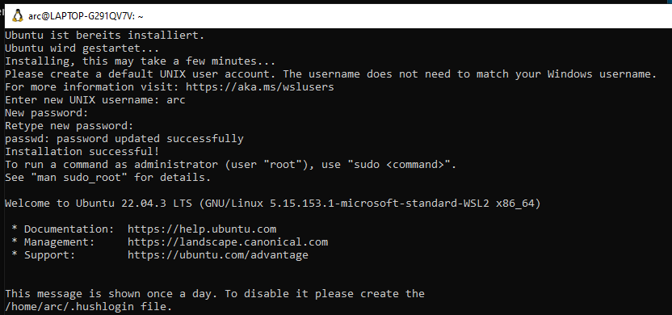

# Project root for the [LVA 183.660 Mobile Robotics WS2024](https://tiss.tuwien.ac.at/course/courseDetails.xhtml?courseNr=183660&semester=2024W)

You can place this project in your home folder under `$HOME/projects/mobile_robotics`.
This document contains installation and setup instructions to detail the setup of the lecture environment. 

# System Architecture

The simulated robot is controlled by *ROS2* (version "*jazzy*") which runs inside a docker container emulating *Ubuntu 24.04*.
The docker container is hosted by an *Ubuntu 22.04* or *24.04* system.
This Ubuntu System may run natively (for students willing to set up a machine with Ubuntu) or it may be part of the Windows Subsystem for Linux (as an option for students running Windows 10, build 19044 or newer).

Other operating systems and versions can be used to host the docker container at your own risk, without any support.

If you wish to use a native installation, follow one of the many guides available on the internet to prepare your system before following the instructions under **Installing Docker and ROS2**.

If you instead want to use the Windows Subsystem for Linux, please follow the guide presented in **Addendum A** to prepare the subsystem before proceeding with **Installing Docker and ROS2**.

**Please prepare your system carfully**


---


# Installing Docker and ROS2

## Docker
1. First install docker on your system <br> Details can be found under [Install using the apt repository](https://docs.docker.com/engine/install/ubuntu/#install-using-the-repository)
2. Setup your user to manage Docker <br> Details can be found under [Manage Docker as a non-root user](https://docs.docker.com/engine/install/linux-postinstall/#manage-docker-as-a-non-root-user) 

## Directories
We distinguish between
* Projects directory - place with all projects you are working on (`~/projects`)
* Project root - a single project (`~/projects/mobile_robotics`)
* Workspace directory - defined by the ROS-Ecosystem to host nodes with sources and binaries. A single project can host multiply workspaces. (`~/projects/mobile_robotics/ws00`, `~/projects/mobile_robotics/ws01`, `~/projects/mobile_robotics/ws02`)

### Projects directory:
Create a projects directory somewhere in your home directory on the docker host, e.g. in `~/projects`. It will be used to host your projects.

#### .bashrc
Prepare your _.bashrc_ so that your work space get sourced if you open a terminal in work space with an _env.sh_ file. All other ROS project sourcing commands in your _.bashrc_ should be removed! 
```
echo 'export PROJECTS_DIR=${HOME}/projects' >> ~/.bashrc           # defines your projects base
echo "if [ -f "env.sh" ]; then source env.sh; fi" >> ~/.bashrc     # forces your bash to source env.sh if it exists
source ~/.bashrc                                                   # reloads/sources your bash
mkdir ${PROJECTS_DIR}                                              # creates the PROJECTS_DIR folder
```
### Project root
The project root will host our project. The directory structure is available as a git repository ready for you to clone.

#### Clone mr2024_root

Configure and add your SSH key to our gitlab server at [gitlab.tuwien.ac.at](gitlab.tuwien.ac.at). A tutorial is available at [https://docs.gitlab.com/ee/user/ssh.html](https://docs.gitlab.com/ee/user/ssh.html)
We are also suggesting creating a GitHub account and to upload ssh keys as well [https://github.com/settings/keys].

If the .bashrc is ready, we can source it and clone the project root into a directory named "mobile_robotics".
``` bash
source ~/.bashrc
cd ${PROJECTS_DIR} 
git clone ssh://git@gitlab.tuwien.ac.at:822/lva-mr/2024/project.git mobile_robotics
# git clone https://gitlab.tuwien.ac.at/lva-mr/2024/project.git mobile_robotics
```
#### .env.local
To host multiple mobile robotics projects, we introduced a `.env.local` file. It configures your project and is used by `env.sh`
It will be created when env.sh is sourced for the first time and it should not be commited into any repository.
``` bash
cd ${PROJECTS_DIR}/mobile_robotics
source ~/.bashrc
```

On a system with a native ROS installation or inside your docker container, you will see
``` 
** ROS2 jazzy initialized with  **
/home/your_user/projects/mobile_robotics/ws00/install/setup.bash does not exist.
/home/your_user/projects/mobile_robotics/ws01/install/setup.bash does not # exist.
/home/your_user/projects/mobile_robotics/ws02/install/setup.bash does not exist.
```

On a docker host without ROS, you will instead see
``` 
A 'env.local' will be created with the project name 'mobile_robotics-private'
ROS_DISTRO 'jazzy' not installed!
```

### Workspace directories:

We are using two workspaces, `ws01` and `ws02`. `ws01` holds existing stuff like our simulation environment. `ws02` holds your things. There is also a `ws00` but this one is only for people interested in details to ROS2 navigation.

#### Clone 
If the .bashrc and the project root is ready we can source it and use the probided Makefile to clone the repos containing the packages we want to use into the correct workspaces.

``` bash
cd $MR_DIR
make clone-ws00
make clone-ws01
```
### VSCode:
Install vscode with the Remote Development Extension on your docker host machine. More details can be found under [Setup ROS 2 with VSCode and Docker](https://docs.ros.org/en/jazzy/How-To-Guides/Setup-ROS-2-with-VSCode-and-Docker-Container.html). Note that this codeblock can be skipped if you are using the WSL and have installed VSCode on Windows.
``` bash
# Install VSCode on your docker host 
sudo apt-get update
sudo apt-get install -y  wget apt-transport-https software-properties-common
wget -q https://packages.microsoft.com/keys/microsoft.asc -O- | sudo apt-key add -
sudo add-apt-repository \
  "deb [arch=amd64] https://packages.microsoft.com/repos/vscode stable main"
sudo apt-get update
sudo apt-get install -y code

# Install Remote Development Extension
code --install-extension ms-vscode-remote.vscode-remote-extensionpack
# Other useful extensions
code --install-extension ms-vscode.cpptools
code --install-extension ms-vscode.cmake-tools
code --install-extension ms-python.python
code --install-extension ms-vscode.makefile-tools
```
#### Open and Build Development Container using vscode
Open VSCode by runnig the following lines on the docker host
``` bash
cd $MR_DIR
code .
```
Use ``View->Command Palette...`` or ``Ctrl+Shift+P`` to open the command palette.
Search for the command ``Dev Containers: Reopen in Container`` and execute it.<br>


This will build your development docker container for your. It will take a while - sit back or go for a coffee. Now you are inside the container.<br>


#### Terminal in your container
##### VSCode terminal
Now you can use the terminal inside VSCode to run commands. We customized the container image for you so that it is easier for you to distinguish between a host and a container terminal.
These changes are:
* The running container host name is mr
* The user and the host name in the terminal have a yellow background.<br>


##### Docker terminal
A other way to connect to the running docker container is by connecting to for a 'normal' terminal. You can use the following command for it.<br>


#### building ws01
ws01 needs to be build only once but sourced every time you are using it. Building will take up to 5 minutes. The source code of the simulation environment is found in one of the repositories previously cloned via '''make clone'''.
``` bash
# we assume that you are inside $MR_DIR and the workspace is sourced
make build-ws01
```

##### Test ws01

``` bash
# we assume that you are inside $MR_DIR and the workspace is sourced
ros2 launch stage_ros2 stage.launch.py   # one robot
ros2 launch stage_ros2 demo.launch.py # multiple robots and rviz
```


#### building ws02

ws02 is the workspace for your code. At the moment it is empty
``` bash
# we assume that you are inside $MR_DIR and the workspace is sourced
make build-ws02
```

##### Test ws02
You need two terminals
``` bash
# we assume that you are inside $MR_DIR and the workspace is sourced
ros2 launch stage_ros2 stage.launch.py
```
``` bash
# we assume that you are inside $MR_DIR and the workspace is sourced
ros2 run mr_move move_node.py --ros-args -r scan:=base_scan
```


---


# Addendum 
## A: Windows Subsystem for Linux
If you are running either Windows 10 (Build 19044 or newer) or Windows 11, you can make use of the Windows Subsystem for Linux as a host for your docker container instead of a native Ubuntu installation. This part of the instructions is designed to get this subsystem set up, so you can follow along with Section .

### VSCode
VSCode is the only piece of software which can not be installed inside the WSL. Luckily, tt will be made be available to the Linux subsystem automatically if it is installed under windows.
Start off by installing VSCode on your Windows-system [here](https://code.visualstudio.com/download).
After finishing the installation, use the GUI to search for and install the following useful extensions:
* Dev Containers
* C/C++
* CMake Tools
* Makefile Tools
* Python

### WSL
Run powershell as an administrator and use the command below to install WSL with an image of the default distribution (which conveniently happens to be Ubuntu Jammy!).
```
wsl --install
```
After successfully installing WSL, reboot your machine. 
You should now see a terminal which is in the process of decompressing the downloaded files. After a while, it will ask you to set up a UNIX user account. Follow along with the instructions, and your Ubuntu environment is ready.



To finish the setup, install the make-package needed to work with Makefiles.

```
sudo apt install make
```

Thats all the setup required to prepare the WSL for this course.

Some useful tips at the end:
* To launch another WSL terminal, use the shortcut found in your start menu. Alternatively, you can use the [Windows Terminal](https://apps.microsoft.com/detail/9n0dx20hk701) which provides convenient access to the Linux Subsystem.
* You can use the Windows file browser to view the files of the Linux subsystem if you want to get a quick overview outside of the terminal.

You are now ready to follow along with part A of these instructions. However, since you have already set up VSCode and all required extensions, you can skip the first code block of the VSCode chapter.


## B: Helpful Tips

* Increase the `HISTSIZE` and `HISTFILESIZE` within the `.bashrc` by a factor of 10 (already done in the virtual box).
* Use bash-completion using the Tab key! 
* Search for old commands in bash using `Ctrl`+`R`.
* Checkout the program tmux 


## C: Common Issues
###  The authenticity of host 'github.com (....)' can't be established
```
Cloning into 'ws01/src/Stage'...
The authenticity of host 'github.com (140.82.121.4)' can't be established.
ED25519 key fingerprint is SHA256:+DiY3wvvV6TuJJhbpZisF/zLDA0zPMSvHdkr4UvCOqU.
This key is not known by any other names
Are you sure you want to continue connecting (yes/no/[fingerprint])? ^Cmake: *** wait: No child processes.  Stop.
make: *** Waiting for unfinished jobs....
make: *** wait: No child processes.  Stop.
```
__Solution__
Change to https or upload your SSL key on github!

Changing the entries in the Makefile
```
sed -i 's/git@github.com:/https:\/\/github.com\//g' Makefile  # https -> git
sed -i 's/https:\/\/github.com\//git@github.com:/g' Makefile  # git -> https
```
Changing existing repos
```
find -path */.git/config -exec sed -i 's/git@github.com:/https:\/\/github.com\//g' {} +
find -path */.git/config -exec sed -i 's/https:\/\/github.com\//git@github.com:/g' {} +
```


## D: Unsupported installations
### Running ROS natively without Docker
If you do not want to work with the provided Docker Container, you can install all required packages natively on your *Ubuntu 24.04* system.
First, you will have to install ROS2 *jazzy*, a guide can be found [here](https://docs.ros.org/en/jazzy/Installation/Ubuntu-Install-Debs.html) (make sure to pick the bare-bones 'ros-jazzy-ros-base'-package).

Then, take a look at "Dockerfile-base" located in this repository. This file is contains the instructions Docker requires to download all other required packages. Luckily, it is human-readable, so you can manually install the listed packages by executing the listed commands in the terminal.
Make sure to remove `RUN` from every command, preface them with `sudo` instead and substitute all occurences of `$ROS_DISTRO` with `jazzy`.

Finally, install VSCode and the required extensions.